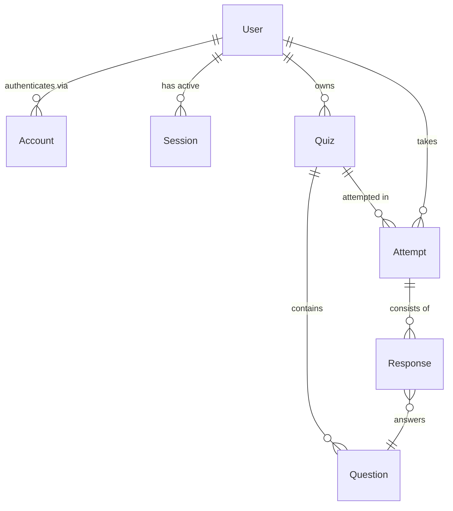

> [<< Documentation Index](./README.md) | [Architecture](./ARCHITECTURE.md) | [API Reference](./API.md)

# QuizAI Domain Ontology

## Executive Summary

QuizAI is an AI-powered adaptive study quiz platform. Users authenticate via OAuth, submit study materials, and receive AI-generated quizzes with multiple question types and difficulty tiers. The system tracks quiz attempts, grades responses (including AI-graded essays), and adapts question difficulty based on performance history. A theme system provides extensive visual customization.

## Core Concepts Map

```
QuizAI Domain
├── Identity & Access
│   ├── User
│   ├── Account (OAuth)
│   ├── Session
│   └── VerificationToken
├── Quiz Lifecycle
│   ├── Quiz
│   ├── Question
│   ├── Attempt
│   └── Response
├── AI Services
│   ├── QuizGenerator
│   ├── EssayGrader
│   └── AdaptiveDifficulty
├── Security
│   ├── InputSanitizer
│   ├── RateLimiter
│   ├── RequestValidator
│   └── SecurityLogger
└── Presentation
    ├── Theme
    ├── ThemeCategory
    └── DifficultyLabel
```

---

## Primary Entities

### User

- **Type**: Domain Entity
- **Category**: Identity & Access
- **Status**: Active

**Definition**: An authenticated individual who creates quizzes, takes attempts, and owns study content. Users exist only through OAuth provider authentication (Google, GitHub, Discord).

**Essential Properties**:
| Property | Type | Constraints |
|----------|------|-------------|
| `id` | `string` | Primary key |
| `email` | `string` | Unique, required |
| `name` | `string \| null` | Optional display name |
| `image` | `string \| null` | Avatar URL from OAuth |
| `createdAt` | `Date` | Auto-set on creation |

**Relationships**:
- **Has-Many**: Quiz (ownership, no cascade delete)
- **Has-Many**: Attempt (quiz attempt history)
- **Has-Many**: Account (OAuth provider links, cascade delete)
- **Has-Many**: Session (active sessions, cascade delete)

**Lifecycle**:
- **Creation**: Automatically on first OAuth sign-in via NextAuth adapter
- **Evolution**: Profile synced from OAuth provider on sign-in
- **Deletion**: Cascades to accounts and sessions; quizzes and attempts reference but don't cascade

**Implementation**: `src/lib/db/schema.ts:3-11` (Drizzle table), `src/types/index.ts:12-18` (interface)

---

### Quiz

- **Type**: Domain Entity (Aggregate Root)
- **Category**: Quiz Lifecycle
- **Status**: Active

**Definition**: A collection of questions generated from study material at a specific difficulty level. The central aggregate in the domain, owned by a user and containing questions.

**Essential Properties**:
| Property | Type | Constraints |
|----------|------|-------------|
| `id` | `string` | Primary key |
| `userId` | `string` | FK to User, required |
| `title` | `string` | 1-200 chars |
| `description` | `string \| null` | Up to 1000 chars |
| `questionCount` | `number` | 5-50, integer |
| `difficulty` | `Difficulty` | Enum: mercy_mode, mental_warfare, abandon_all_hope |
| `questionTypes` | `QuestionType[]` | JSON array, at least one type |
| `studyMaterial` | `string \| null` | Source content (50-100k chars for generation) |
| `currentDifficultyScore` | `number` | 0.0-1.0 scale, default 0.5 |
| `createdAt` | `Date` | Auto-set |
| `updatedAt` | `Date` | Auto-set |

**Relationships**:
- **Belongs-To**: User (ownership)
- **Has-Many**: Question (composition, cascade delete)
- **Has-Many**: Attempt (quiz history, cascade delete)

**Constraints & Rules**:
- A quiz must have at least one question type selected
- Study material minimum 50 characters for AI generation
- Maximum 50 questions per quiz
- Only the owning user may view or delete the quiz

**Lifecycle**:
- **Creation**: Via AI generation (`POST /api/quizzes/generate`) or manual creation (`POST /api/quizzes`)
- **Evolution**: `currentDifficultyScore` updated by adaptive difficulty engine as user takes attempts
- **Deletion**: Owner-only, cascades to questions and attempts

**Implementation**: `src/lib/db/schema.ts:45-65` (table), `src/types/index.ts:20-32` (interface)

---

### Question

- **Type**: Domain Entity (part of Quiz aggregate)
- **Category**: Quiz Lifecycle
- **Status**: Active

**Definition**: A single assessment item within a quiz. Can be one of five types, each with different answer formats. Generated by AI or created manually.

**Essential Properties**:
| Property | Type | Constraints |
|----------|------|-------------|
| `id` | `string` | Primary key |
| `quizId` | `string` | FK to Quiz, cascade delete |
| `type` | `QuestionType` | Enum: multiple_choice, essay, short_answer, true_false, select_all |
| `content` | `string` | Question text, max 5000 chars |
| `options` | `string[] \| null` | JSON array; 4 for MC, 2 for T/F, 4-6 for select_all, null for essay/short_answer |
| `correctAnswer` | `string` | Single letter for MC/T-F, JSON array for select_all, text for essay |
| `explanation` | `string \| null` | Why the answer is correct |
| `difficulty` | `number` | 0.0-1.0 scale, default 0.5 |
| `order` | `number` | Display ordering within quiz |

**Relationships**:
- **Part-Of**: Quiz (composition)
- **Referenced-By**: Response (via questionId)

**Type Specifications**:
| QuestionType | Options | CorrectAnswer Format |
|---|---|---|
| `multiple_choice` | 4 options (A-D) | Single letter: `"A"` |
| `true_false` | `["True", "False"]` | `"true"` or `"false"` |
| `short_answer` | `null` | Reference text |
| `essay` | `null` | Key points/rubric |
| `select_all` | 4-6 options | JSON array: `["A","C","D"]` |

**Implementation**: `src/lib/db/schema.ts:67-81` (table), `src/types/index.ts:34-44` (interface)

---

### Attempt

- **Type**: Domain Entity
- **Category**: Quiz Lifecycle
- **Status**: Active

**Definition**: A single session of a user taking a quiz. Tracks the start time, completion, and aggregate scoring. Contains individual responses.

**Essential Properties**:
| Property | Type | Constraints |
|----------|------|-------------|
| `id` | `string` | Primary key |
| `quizId` | `string` | FK to Quiz, cascade delete |
| `userId` | `string` | FK to User |
| `score` | `number \| null` | Percentage (0-100), null until complete |
| `totalQuestions` | `number \| null` | Count at completion |
| `correctAnswers` | `number \| null` | Count at completion |
| `startedAt` | `Date` | Auto-set on creation |
| `completedAt` | `Date \| null` | Set when all questions answered |

**Relationships**:
- **Belongs-To**: Quiz (quiz being taken)
- **Belongs-To**: User (test taker)
- **Has-Many**: Response (individual answers, cascade delete)

**Lifecycle**:
- **Creation**: When user begins a quiz session
- **Evolution**: `completedAt`, `score`, `totalQuestions`, `correctAnswers` populated on completion
- **Deletion**: Cascaded from quiz deletion

**Implementation**: `src/lib/db/schema.ts:83-98` (table), `src/types/index.ts:46-55` (interface)

---

### Response

- **Type**: Domain Entity
- **Category**: Quiz Lifecycle
- **Status**: Active

**Definition**: A user's answer to a single question within an attempt. For essay/short_answer types, includes AI-generated grading feedback.

**Essential Properties**:
| Property | Type | Constraints |
|----------|------|-------------|
| `id` | `string` | Primary key |
| `attemptId` | `string` | FK to Attempt, cascade delete |
| `questionId` | `string` | FK to Question, cascade delete |
| `userAnswer` | `string \| null` | The submitted answer |
| `isCorrect` | `boolean \| null` | Grading result |
| `aiGradingFeedback` | `string \| null` | AI feedback for essay/short_answer |
| `answeredAt` | `Date` | Auto-set |

**Relationships**:
- **Part-Of**: Attempt (composition)
- **References**: Question (the question being answered)

**Implementation**: `src/lib/db/schema.ts:100-114` (table), `src/types/index.ts:57-65` (interface)

---

## Value Objects

### Difficulty

- **Type**: Value Object (Enum)
- **Values**: `"mercy_mode"` | `"mental_warfare"` | `"abandon_all_hope"`

**Semantic Meaning**:
| Value | Label | Difficulty Range | Description |
|-------|-------|-----------------|-------------|
| `mercy_mode` | Mercy Mode | 0.1 - 0.5 | Beginner-friendly, clear answers, helpful hints |
| `mental_warfare` | Mental Warfare | 0.4 - 0.8 | Challenging, deep understanding, nuanced answers |
| `abandon_all_hope` | Abandon All Hope | 0.7 - 1.0 | Expert-level, edge cases, synthesis required |

Each difficulty has a `min`, `base`, and `max` numeric range for the adaptive engine.

**Implementation**: `src/types/index.ts:3`, `src/lib/ai/adaptive.ts:14-18`

---

### QuestionType

- **Type**: Value Object (Enum)
- **Values**: `"multiple_choice"` | `"essay"` | `"short_answer"` | `"true_false"` | `"select_all"`

**Grading Behavior**:
| Type | Grading Method | AI Required |
|------|---------------|-------------|
| `multiple_choice` | Exact match | No |
| `true_false` | Exact match | No |
| `short_answer` | AI grading | Yes |
| `essay` | AI grading | Yes |
| `select_all` | Set comparison | No |

**Implementation**: `src/types/index.ts:5-10`

---

### AIProvider

- **Type**: Value Object (Enum)
- **Values**: `"openai"` | `"anthropic"` | `"claude-code"`

Determines which AI backend processes generation or grading requests. Configurable via `DEFAULT_AI_PROVIDER` environment variable.

**Implementation**: `src/types/index.ts:108`

---

### ThemeId

- **Type**: Value Object (Enum)
- **Values**: 15 theme identifiers across 5 categories

**Categories**: Editorial, Cyberpunk, Dracula, Arc, Glass. Each has light, dark, and neon variants.

**Implementation**: `src/lib/theme-config.ts:1-17`

---

## Services

### QuizGenerator

- **Type**: Domain Service
- **Category**: AI Services

**Definition**: Orchestrates AI-powered quiz creation from study material. Routes to the appropriate AI provider, handles prompt construction with security boundaries, validates responses.

**Process Flow**:
1. Receive generation parameters (material, count, difficulty, types)
2. Sanitize study material (prompt injection prevention)
3. Build defensive prompt with XML-tagged user content
4. Route to selected AI provider (OpenAI GPT-4 Turbo / Anthropic Claude / Claude CLI)
5. Parse JSON response with structural validation
6. Validate quiz response against schema
7. Return `GeneratedQuiz`

**Depends-On**: InputSanitizer, AI provider clients (OpenAI, Anthropic, ClaudeCode), SecurityLogger

**Implementation**: `src/lib/ai/index.ts`

---

### EssayGrader

- **Type**: Domain Service
- **Category**: AI Services

**Definition**: Uses AI to grade essay and short_answer question responses. Returns a score (0-100), correctness boolean (threshold: 70), and constructive feedback.

**Process Flow**:
1. Receive question, correct answer, user answer, and question type
2. Build grading prompt
3. Send to AI provider
4. Parse JSON grading response
5. Return `{score, isCorrect, feedback}`

**Depends-On**: AI provider clients

**Implementation**: `src/lib/ai/index.ts:275-320` (prompt + parser)

---

### AdaptiveDifficulty

- **Type**: Domain Service
- **Category**: AI Services

**Definition**: Adjusts question difficulty based on user performance history. Uses exponential decay weighting (recent answers matter more), streak detection, and improvement trend analysis.

**Key Functions**:
| Function | Purpose |
|----------|---------|
| `calculateNextDifficulty` | Weighted performance analysis, returns 0.0-1.0 clamped to difficulty bounds |
| `getStreakModifier` | Hot streak (+0.05/+0.1) and cold streak (-0.05/-0.1) adjustments |
| `calculatePerformanceMetrics` | Overall/recent accuracy, streak info, improvement trend |
| `getPerformanceMessage` | Contextual encouragement based on metrics |

**Algorithm**: Last 10 answers weighted with `1.5^index` exponential decay. Performance ratio above 0.7 increases difficulty; below 0.3 decreases. Result clamped to difficulty tier bounds.

**Implementation**: `src/lib/ai/adaptive.ts`

---

### InputSanitizer

- **Type**: Infrastructure Service
- **Category**: Security

**Definition**: Prevents prompt injection attacks by detecting and neutralizing malicious patterns in user-submitted study material before AI processing.

**Detection Categories**:
- Instruction override attempts (`ignore previous instructions`)
- System/role manipulation (`you are now a`, `pretend to be`)
- Direct injection markers (`[system]`, `<instruction>`)
- Output manipulation (`output only`, `return this exact json`)
- Escape sequences (null bytes, zero-width characters, bidirectional controls)

**Actions**: Detects patterns, strips escape sequences, replaces injection markers with `[blocked]`, normalizes whitespace, logs security events.

**Implementation**: `src/lib/sanitize.ts`

---

### RateLimiter

- **Type**: Infrastructure Service
- **Category**: Security

**Definition**: In-memory sliding window rate limiter with lazy cleanup. Prevents abuse of expensive endpoints.

**Rate Limit Configurations**:
| Endpoint | Limit | Window |
|----------|-------|--------|
| AI Generation | 5 requests | 1 minute |
| AI Grading | 20 requests | 1 minute |
| General API | 60 requests | 1 minute |
| Auth endpoints | 30 requests | 5 minutes |

**Implementation**: `src/lib/rate-limit.ts` (API), `src/middleware.ts:15-45` (auth)

---

### RequestValidator

- **Type**: Infrastructure Service
- **Category**: Security

**Definition**: Zod-based runtime validation for API request payloads. Complements TypeScript compile-time checking with runtime guarantees.

**Schemas**:
| Schema | Endpoint | Key Constraints |
|--------|----------|----------------|
| `GenerateQuizRequestSchema` | `POST /api/quizzes/generate` | Title 1-200 chars, material 50-100k chars, count 5-50 |
| `CreateQuizRequestSchema` | `POST /api/quizzes` | Title 1-200 chars, at least one question type |
| `GradeRequestSchema` | `POST /api/ai` | Question/answer required, type must be essay or short_answer |

**Implementation**: `src/lib/validations.ts`

---

## Key Relationships

### Entity Relationship Diagram



### Critical Relationships

1. **User owns Quiz** (One-to-Many)
   - Users can only access their own quizzes
   - Ownership enforced at API level (session userId check)
   - Quiz deletion does NOT cascade from user deletion

2. **Quiz contains Questions** (One-to-Many, Composition)
   - Questions cannot exist without a quiz
   - Cascade delete: removing a quiz removes all its questions
   - Questions ordered by `order` field within quiz

3. **Attempt records Responses** (One-to-Many, Composition)
   - Responses capture individual answers within an attempt
   - Cascade delete from attempt
   - Each response references exactly one question

4. **User authenticates via Account** (One-to-Many)
   - Multiple OAuth providers per user (Google, GitHub, Discord)
   - Cascade delete: removing user removes all linked accounts
   - Managed entirely by NextAuth adapter

### Service Dependencies

```mermaid
graph TD
    API[API Routes] --> Auth[Authentication Middleware]
    API --> RateLimit[Rate Limiter]
    API --> Validator[Request Validator]

    GenRoute[/api/quizzes/generate] --> Sanitizer[Input Sanitizer]
    GenRoute --> QuizGen[Quiz Generator]

    GradeRoute[/api/ai] --> Grader[Essay Grader]

    QuizGen --> OpenAI[OpenAI Client]
    QuizGen --> Anthropic[Anthropic Client]
    QuizGen --> ClaudeCLI[Claude Code CLI]
    Grader --> OpenAI
    Grader --> Anthropic

    QuizGen --> Logger[Security Logger]
    Sanitizer --> Logger
    RateLimit --> Logger
    Auth --> Logger
```

---

## Business Rules and Constraints

### Domain Rules

1. **Quiz Ownership**: A user can only access (read, delete) quizzes they created
2. **AI Generation Limits**: Maximum 5 quiz generations per minute per user
3. **Material Requirements**: Study material must be 50-100,000 characters for AI generation
4. **Question Bounds**: Quizzes contain 5-50 questions
5. **Difficulty Progression**: Adaptive difficulty stays within tier bounds (mercy: 0.1-0.5, warfare: 0.4-0.8, abandon: 0.7-1.0)
6. **Essay Grading Threshold**: Score >= 70 is considered "correct"

### Invariants

- Every quiz has at least one question type
- Every question has a non-empty `content` and `correctAnswer`
- `currentDifficultyScore` is always between 0.0 and 1.0
- Rate limit state is per-user for API endpoints, per-IP for auth endpoints
- All AI responses are structurally validated before persistence

---

## Processes and Workflows

### Quiz Generation (Core Business Process)

```
Trigger: User submits study material + configuration
Actors: User, API Route, Sanitizer, QuizGenerator, AI Provider, Database

Flow:
1. User submits form data (title, material, count, difficulty, types)
2. API route authenticates user (JWT middleware)
3. Rate limiter checks AI generation quota (5/min)
4. Request validator checks payload against Zod schema
5. Input sanitizer scans material for injection patterns
6. Quiz generator builds defensive prompt with XML-tagged user content
7. AI provider generates JSON quiz response
8. Response parser validates JSON structure and question format
9. Quiz + questions persisted to SQLite database
10. Generated quiz returned to client
```

### Quiz Taking

```
Trigger: User selects a quiz to take
Actors: User, Client App, API, Database

Flow:
1. Client fetches quiz with questions (GET /api/quizzes/:id)
2. New attempt record created with startedAt timestamp
3. User answers questions sequentially
4. For MC/TF/select_all: client-side correctness check
5. For essay/short_answer: POST /api/ai for AI grading
6. Response records created for each answered question
7. Attempt completed: score, correctAnswers, completedAt calculated
8. Adaptive difficulty recalculates quiz difficulty score
```

### Authentication

```
Trigger: User visits protected route while unauthenticated
Actors: User, Middleware, NextAuth, OAuth Provider

Flow:
1. Middleware intercepts request, checks JWT token
2. No valid token -> redirect to /login with callbackUrl
3. User selects OAuth provider (Google/GitHub/Discord)
4. OAuth flow: redirect -> provider consent -> callback
5. NextAuth creates/updates User + Account records
6. JWT session token issued (7-day expiry, 24-hour refresh)
7. User redirected to original callbackUrl
```

---

## Integration Points

### External Systems

| System | Integration Type | Purpose |
|--------|-----------------|---------|
| OpenAI API | REST (GPT-4 Turbo) | Quiz generation, essay grading |
| Anthropic API | REST (Claude Sonnet 4) | Quiz generation, essay grading |
| Claude Code CLI | Subprocess (stdin/stdout) | Optional local AI generation |
| Google OAuth | OAuth 2.0 | User authentication |
| GitHub OAuth | OAuth 2.0 | User authentication |
| Discord OAuth | OAuth 2.0 | User authentication |
| SQLite | File-based DB (Drizzle ORM) | All data persistence |

### Data Flows

**Inbound**:
- Study material text from users (max 100k chars)
- OAuth tokens/profile data from identity providers
- AI-generated JSON quiz/grading responses

**Outbound**:
- Study material sent to AI providers (sanitized)
- Question + answer context sent for AI grading
- OAuth redirect URLs to identity providers

---

## Concept Hierarchy (Full Taxonomy)

```
QuizAI
├── Domain Entities
│   ├── User (Identity, aggregate root)
│   ├── Quiz (Content, aggregate root)
│   │   └── Question (Content, value within aggregate)
│   ├── Attempt (Assessment, aggregate root)
│   │   └── Response (Assessment, value within aggregate)
│   ├── Account (Identity, managed by NextAuth)
│   ├── Session (Identity, managed by NextAuth)
│   └── VerificationToken (Identity, managed by NextAuth)
│
├── Value Objects
│   ├── Difficulty ("mercy_mode" | "mental_warfare" | "abandon_all_hope")
│   ├── QuestionType ("multiple_choice" | "essay" | "short_answer" | "true_false" | "select_all")
│   ├── AIProvider ("openai" | "anthropic" | "claude-code")
│   ├── ThemeId (15 variants across 5 categories)
│   └── AnswerHistory {questionId, isCorrect, difficulty, questionType}
│
├── Domain Services
│   ├── QuizGenerator (AI quiz creation orchestration)
│   ├── EssayGrader (AI-powered answer assessment)
│   └── AdaptiveDifficulty (performance-based difficulty adjustment)
│
├── Infrastructure Services
│   ├── InputSanitizer (prompt injection prevention)
│   ├── RateLimiter (request throttling)
│   ├── RequestValidator (Zod schema validation)
│   ├── SecurityLogger (Pino-based audit logging)
│   └── AuthMiddleware (JWT verification + route protection)
│
├── API Layer (Next.js App Router)
│   ├── POST /api/quizzes/generate (AI quiz creation)
│   ├── GET /api/quizzes (list user quizzes)
│   ├── POST /api/quizzes (manual quiz creation)
│   ├── GET /api/quizzes/:id (get quiz with questions)
│   ├── DELETE /api/quizzes/:id (delete quiz)
│   ├── POST /api/ai (grade essay/short answer)
│   ├── GET /api/health (health check)
│   └── /api/auth/* (NextAuth endpoints)
│
├── Presentation Layer
│   ├── Pages
│   │   ├── Landing (/)
│   │   ├── Login (/login)
│   │   ├── Dashboard (/dashboard)
│   │   ├── New Quiz (/dashboard/quiz/new)
│   │   └── Quiz Detail (/dashboard/quiz/:id)
│   ├── Components
│   │   ├── Dashboard: Header, Sidebar, QuizList, SettingsPopover
│   │   ├── Quiz: QuizForm, QuizCard, QuestionRenderer, DifficultyIndicator
│   │   ├── UI: Button, Input, Textarea, Card, Badge, Progress
│   │   ├── Auth: OAuthButtons
│   │   └── Landing: AIGenerationAnimation
│   ├── Hooks
│   │   ├── useAI (grading operations)
│   │   ├── useQuiz (CRUD operations)
│   │   └── useTheme (theme switching)
│   └── Contexts
│       └── ThemeContext (15 themes, localStorage persistence)
│
└── Infrastructure
    ├── Database: SQLite + Drizzle ORM (WAL mode, lazy init)
    ├── Auth: NextAuth v5 (JWT strategy, 3 OAuth providers)
    ├── AI Clients: OpenAI, Anthropic, Claude Code (lazy init)
    ├── Logging: Pino (structured, redaction, security events)
    └── Deployment: Docker multi-stage, Cloudflared tunnel
```

---

## Quality Assessment

### Model Health

- **Complexity**: Moderate. Six core domain tables with clear relationships. AI service layer adds orchestration complexity but is well-isolated.
- **Consistency**: High. Naming conventions are consistent (camelCase properties, snake_case DB columns). All enums defined once and reused.
- **Completeness**: The core quiz lifecycle (create -> take -> grade -> adapt) is fully modeled. Auth delegation to NextAuth keeps the boundary clean.

### Architecture Patterns

- **Layered Architecture**: Presentation (components/pages) -> API Routes -> Services -> Database
- **Aggregate Pattern**: Quiz is the primary aggregate root containing Questions; Attempt contains Responses
- **Strategy Pattern**: AI provider selection via `AIProvider` enum
- **Defensive Prompting**: XML-tagged user content boundaries in AI prompts
- **Lazy Initialization**: Database and AI clients initialized on first use, not at import time

### Security Posture

- Input sanitization at AI boundary (OWASP A03:2021)
- Rate limiting at API and auth layers (OWASP A04:2021)
- JWT-based session validation in middleware (OWASP A07:2021)
- Structured security event logging with field redaction (OWASP A09:2021)
- Runtime schema validation with Zod at all API boundaries
